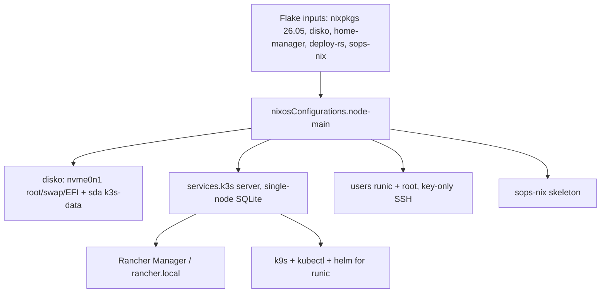
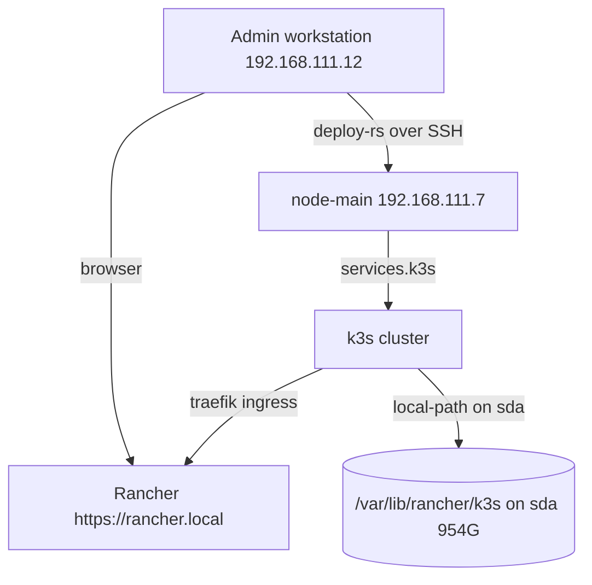

# ADR-26: Adopt NixOS as the host OS on node-main

## Context and Problem Statement

node-main runs Ubuntu with a k3s cluster installed via the curl script. Configuration
drifted across manual edits; reinstalling the host meant repeating undocumented steps,
and secrets lived in world-readable places. The homelab wants a declarative, reproducible
host OS that keeps the existing k3s workloads running unchanged.

Research `03_Research/nixos-adoption/overview.md` evaluated deployment tooling and
selected deploy-rs (flake-native, automatic rollback) with sops-nix for secrets,
and confirmed the in-tree nixpkgs k3s module (nix-community/k3s-nix is dead).

## Decision

Adopt **NixOS 26.05** as the host OS on node-main:

- **Bootstrap**: `nixos-anywhere` (direct-boot against the NixOS installer) with a disko
  layout — nvme0n1 (EFI + swap + ext4 root) and sda (ext4 mounted at
  `/var/lib/rancher/k3s` for k3s data).
- **Ongoing deployment**: `deploy-rs` from a single flake at
  `05_Implementations/node-main/nixos/` (`autoRollback` + `magicRollback`).
- **Workloads**: k3s single-node server via the in-tree module (`services.k3s`),
  SQLite datastore, auto-generated token, `--write-kubeconfig-mode 644`.
- **Secrets**: sops-nix skeleton (`sops.age.sshKeyPaths`), no secrets yet.
- **Access**: admin user `runic` + root, key-only SSH
  (`PasswordAuthentication false`), passwordless sudo via wheel.
- **Observability/ops UI**: Rancher Manager deployed on the k3s cluster at
  `https://rancher.local`; k9s for terminal cluster ops.

## Fit into Homelab

node-main keeps the existing homelab services role (ingress, workloads, storage) while
the host OS becomes fully declarative. Ongoing changes flow through the flake via
deploy-rs; the same flake can later target additional nodes.
