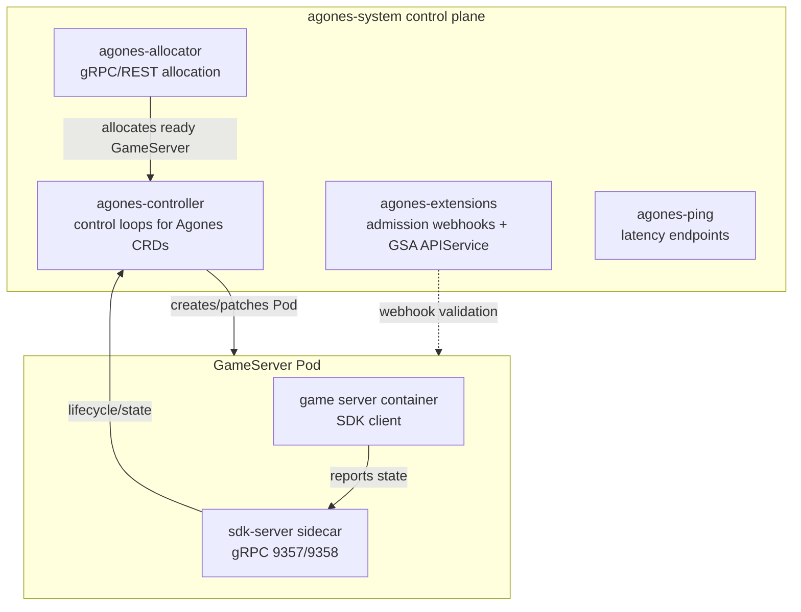
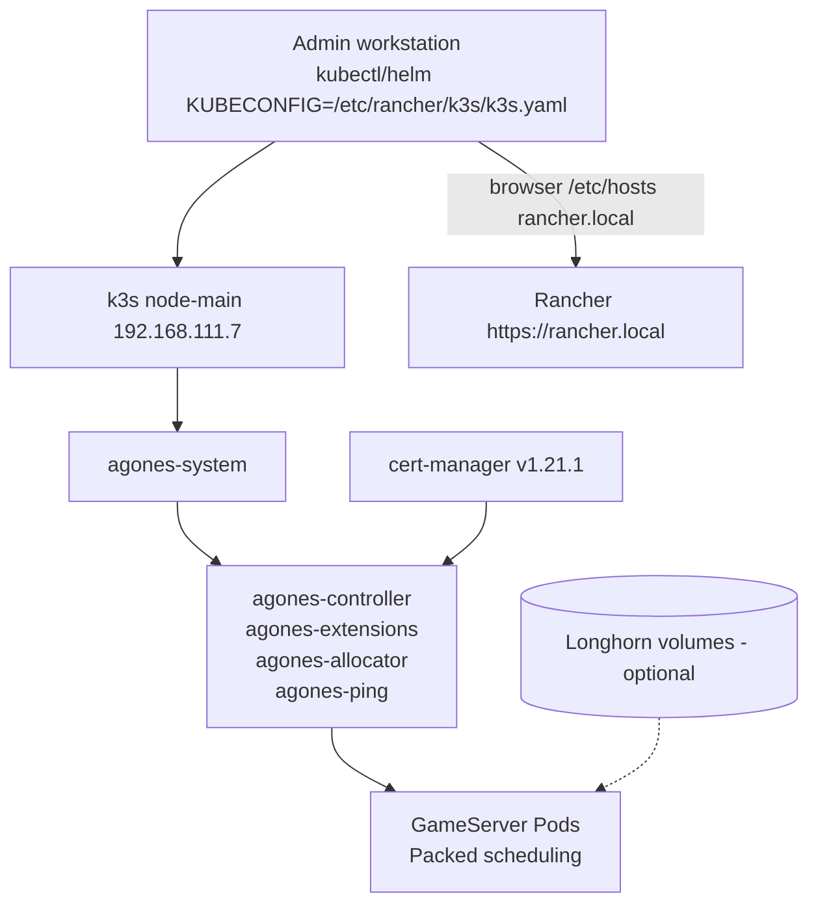

# ADR-317: Adopt Agones for dedicated game servers

## Context and Problem Statement

The homelab runs no game servers today; nothing hosts dedicated game sessions on
the single-node k3s cluster (`node-main`, 192.168.111.7). The homelab wants a
self-hosted, low-latency multiplayer platform without a managed cloud dependency.
Research `./03_Research/agones-adoption/overview.md` evaluated the dedicated game
server orchestration options — raw Kubernetes Deployments (rejected: no
dedicated-server lifecycle or allocation API), Open Match and Quilkin (complements,
not substitutes — matchmaking and UDP routing respectively), and Amazon GameLift
(rejected: managed SaaS) — and recommends **approve** for Agones v1.60.0.

## Decision

Adopt **Agones v1.60.0** (CNCF sandbox, open source) as the dedicated game server
orchestration layer on the k3s cluster:

- **Install**: Helm chart into the `agones-system` namespace on `node-main`, using
  Helm 3 + kubectl with `KUBECONFIG=/etc/rancher/k3s/k3s.yaml`.
- **TLS**: reuse the cert-manager v1.21.1 already installed for Rancher to issue
  controller/allocator certificates; no second issuer.
- **API surface**: `GameServer`, `Fleet`, `FleetAutoscaler`, and
  `GameServerAllocation` custom resources declare servers, buffers, and allocation.
- **Game integration**: each `GameServer` is backed by a single Pod with an Agones
  SDK-server sidecar; the game binary reports state over gRPC on ports 9357/9358.
- **Why**: Agones is the only alternative purpose-built for the dedicated-server
  lifecycle, allocation, and autoscaling on Kubernetes, and it builds on the
  existing k3s stack instead of introducing a separate platform or SaaS.

## Fit into Homelab

Agones lands inside the existing single-node Rancher-managed k3s cluster:

- **Target**: `node-main` (192.168.111.7), namespace `agones-system`.
- **Version check**: confirm the k3s minor version against the Agones 1.60.0
  support matrix (Kubernetes 1.34–1.36) with `kubectl version` before installing.
- **Hosts pattern**: any allocator endpoint hostname follows the `rancher.local`
  pattern — `networking.extraHosts` in the NixOS flake on the node plus
  `/etc/hosts` on browser machines.
- **Scheduling**: `Packed` (Agones default) — every GameServer Pod lands on
  `node-main` anyway, so `Distributed` has no second node to spread across.
- **Autoscaling**: `FleetAutoscaler` keeps a ready-GameServer buffer, bounded by
  single-node capacity.
- **Storage**: the Agones control plane needs no PVC; GameServer Pods that want
  volumes can use Longhorn.

The decision follows the research recommendation and clears the way for the
`05_Implementations/` stage: Helm install into `agones-system`, allocator endpoint
wiring, and SDK integration for game workloads.
