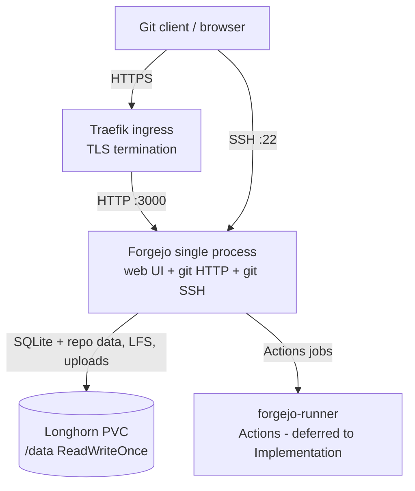
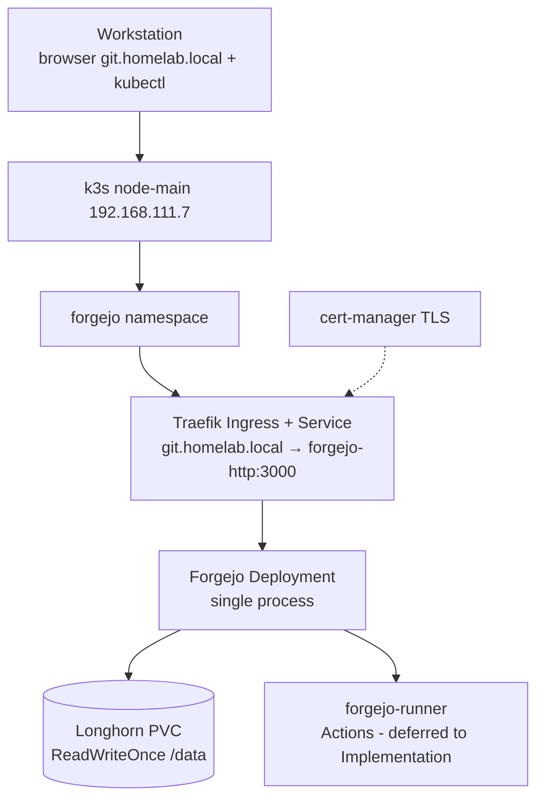

# ADR-320: Adopt Forgejo for self-hosted Git hosting

## Context and Problem Statement

The homelab's private Git workflows still depend on SaaS GitHub — repositories,
issues, and CI live off local hardware, with the accompanying vendor lock-in,
rate limits, and per-user cost (per
`./02_Knowledge/technologies/services/forgejo/overview.md`). The goal is
self-hosted, private Git hosting on the existing single-node k3s cluster
(`node-main`, 192.168.111.7). Research
`./03_Research/forgejo-adoption/overview.md` evaluated Forgejo vs Gitea vs
GitLab CE vs Gogs and recommends **approve** for Forgejo: Gitea is at
near-parity but rejected on for-profit corporate governance, GitLab CE is too
heavy, and Gogs too minimal for this homelab. Alternatives are evaluated in
that research; this ADR records only the decision.

## Decision

Adopt **Forgejo v16** as the homelab's self-hosted Git server on the
single-node k3s cluster:

- **Governance**: Forgejo is a community-run fork of Gitea under the Codeberg
  e.V. umbrella — a soft-fork in Oct 2022 that became a hard fork in early 2024
  (per https://forgejo.org/compare-to-gitea/).
- **Footprint**: a single Go binary serves the web UI, git over HTTP, and git
  over SSH; SQLite is the default database and is enough for a single-owner
  homelab instance, with PostgreSQL as the option for heavier use (per
  `./02_Knowledge/technologies/services/forgejo/overview.md` and
  `./02_Knowledge/technologies/services/forgejo/install-config.md`).
- **Deploy target**: namespace `forgejo` on `node-main`, reached at
  `git.homelab.local` through a Traefik Ingress; service port 3000; repository
  data, LFS, and uploads on a Longhorn PVC (per
  `./02_Knowledge/technologies/services/forgejo/install-config.md`).
- **CI**: Forgejo Actions, executed by `forgejo-runner` deployed alongside
  Forgejo in the `forgejo` namespace; runner provisioning is deferred to the
  Implementation stage (per
  `./02_Knowledge/technologies/services/forgejo/ci-act-runners.md`).
- **Why**: removes the SaaS dependency for private Git hosting while fitting
  the existing k3s/Traefik/Longhorn stack (per the research overview).

> Deployment is not live yet — the manifest and config references above are
> **Example — abstract**, not running config (per the research overview).

## Fit into Homelab

Forgejo lands inside the existing single-node k3s cluster:

- **Target**: `node-main` (192.168.111.7), namespace `forgejo`, ingress host
  `git.homelab.local` via Traefik (Kubernetes Ingress per
  https://kubernetes.io/docs/concepts/services-networking/ingress/).
- **Storage**: Longhorn PVC (ReadWriteOnce is fine on one node); Longhorn
  snapshots back up the SQLite database and repo data (per
  `./02_Knowledge/technologies/services/forgejo/operations.md` and
  https://longhorn.io/docs/).
- **TLS**: Traefik terminates HTTPS on the Ingress using cert-manager; Forgejo
  serves plain HTTP internally on port 3000 with `ROOT_URL` set to
  `https://git.homelab.local/` (per
  `./02_Knowledge/technologies/services/forgejo/install-config.md`).
- **Secrets**: `SECRET_KEY`, DB password, and runner tokens live in k8s Secrets
  (per `./02_Knowledge/technologies/services/forgejo/security.md`).
- **Hardening**: HTTPS-only exposure, `DISABLE_REGISTRATION` to block public
  sign-up, scoped access tokens, and 2FA (per
  `./02_Knowledge/technologies/services/forgejo/security.md`).
- **Migration**: existing GitHub repositories come in via one-shot migration or
  pull mirrors; LFS objects are not mirrored over SSH push mirrors, so verify
  LFS transfer (per
  `./02_Knowledge/technologies/services/forgejo/migration.md`).

The decision follows the research recommendation and clears the way for the
`05_Implementations/` stage: install into `forgejo`, ingress + Longhorn PVC
wiring, GitHub migration, and runner provisioning.
