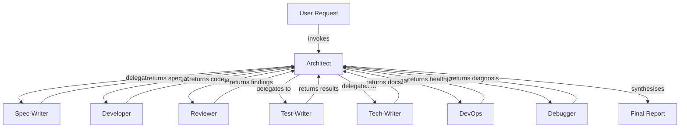

# ADR-0007: RuneSmith Plugin Architecture

## README.md

# ADR 0007: RuneSmith Plugin Architecture

Architecture decision record for the `@runicengines/opencode-runesmith` plugin — the org-wide agent plugin bundling role-based subagents, reusable skills, and init hook infrastructure for cross-repo development automation.

[overview.md](./overview.md) contains the full decision record in MADR format.

## overview.md

---
adr: 0007
title: "RuneSmith Plugin Architecture"
author: "refactorartist (Khalid Zubair)"
status: final
date: 2026-06-14
topic: "agent-plugin"
date-proposed: 2026-06-14
history: "https://github.com/RunicEngines/knowledge-base/pull/75"
context: >
  RunicEngines is a new cooperative maintaining multiple code repositories.
  Each repo needs consistent access to AI-powered agents and skills for
  development workflows — issue decomposition, code implementation, review,
  testing, documentation, and deployment. Without a shared plugin, each repo
  would duplicate agent definitions, leading to fragmentation and drift.
  OpenCode's plugin system can deliver a unified set of agents and skills
  across all repositories, but the architecture must be decided: distribution
  mechanism, orchestration pattern, agent-skill boundary, namespace strategy,
  update propagation, testing methodology, and cross-repo integration rules.
decision: >
  Adopt the @runicengines/opencode-runesmith npm plugin distributed via
  GitHub Packages with hub-and-spoke orchestration, 7 role-based subagents,
  14 reusable skills, version-stamping init hook, rs- prefix namespace,
  Pydantic AI testing methodology, and strict KB non-delegation boundary.
consequences: >
  Single dependency delivers full automation suite across all repos.
  Initial setup requires GitHub Packages auth. Hub architect becomes
  serialization point. Version-stamping solves update propagation but
  adds init hook complexity. No cross-delegation keeps KB and plugin
  independent. npm + GitHub Packages couples distribution to GitHub
  ecosystem.
sources:
  - "../knowledge/tooling/opencode/plugins/architecture"
  - "../knowledge/tooling/opencode/plugins/bundling-components"
  - "../knowledge/tooling/opencode/plugins/init-hook-lifecycle"
  - "../knowledge/tooling/opencode/plugins/npm-packaging"
  - "../knowledge/tooling/opencode/plugins/private-distribution"
  - "../knowledge/tooling/opencode/plugins/versioning"
  - "../knowledge/tooling/opencode/agents/overview"
  - "../knowledge/tooling/opencode/agents/permissions"
  - "../knowledge/tooling/opencode/agents/orchestration-patterns"
  - "../knowledge/tooling/opencode/agents/agent-file-reference"
  - "../knowledge/tooling/opencode/agents/discovery"
  - "../knowledge/tooling/opencode/skills/concepts"
  - "../knowledge/tooling/opencode/skills/workflow-patterns"
  - "../knowledge/tooling/opencode/mcp/concepts"
  - "../knowledge/tooling/opencode/mcp/configuration"
  - "../knowledge/technology/python/pydantic-ai/gold-dataset-schemas"
  - "../knowledge/technology/python/pydantic-ai/gold-dataset-versioning"
  - "../knowledge/technology/python/pydantic-ai/llm-judge-rubrics"
  - "../knowledge/technology/python/pydantic-ai/llm-judge-scoring"
references:
  - "https://github.com/RunicEngines/knowledge-base/issues/21"
  - "https://github.com/RunicEngines/knowledge-base/issues/55"
  - "https://opencode.ai/docs/plugins"
  - "https://opencode.ai/docs/agents"
  - "https://opencode.ai/docs/skills"
  - "https://opencode.ai/docs/permissions"
  - "https://semver.org/spec/v2.0.0.html"
  - "https://keepachangelog.com/en/2.0.0/"
---

# ADR 0007: RuneSmith Plugin Architecture

## Status

Final (2026-06-14)

> **Amendment 2026-06-14:** Skill inventory expanded from 14 to 20 (+6 new skills). Agent roster expanded from 7 to 8 (+rs-debugger). See Decision 10 and Agent Roster.

## Context and Problem Statement

RunicEngines is a new cooperative company that will maintain multiple code repositories as it grows. Each repository needs consistent access to AI-powered agents and skills for common development workflows:

- Decomposing GitHub issues into structured implementation plans
- Writing and reviewing code against team conventions
- Running tests and diagnosing failures
- Generating documentation and changelogs
- Managing CI/CD and deployments

Without a shared automation layer, each repository would independently define its own agents and skills — duplicating effort, fragmenting conventions, and creating drift that undermines the cooperative's shared standards (ADR 0002). A single, centrally maintained plugin provides a consistent set of agents and skills across all repositories.

OpenCode offers a plugin system for exactly this purpose: npm packages that bundle agent definitions, skill instructions, and startup hooks into a single distributable unit. However, the architecture requires deliberate decisions across multiple dimensions:

- **Distribution** — How is the plugin installed and updated across repos?
- **Orchestration** — How do agents coordinate on multi-step workflows?
- **Agent-Skill boundary** — What goes in an agent prompt vs a reusable skill?
- **Namespace** — How are agents and skills named to avoid collisions?
- **Update propagation** — How do updated agent/skill files reach consumer projects?
- **Testing** — How is agent behaviour validated before release?
- **KB relationship** — How does the plugin relate to the existing knowledge-base agents?

This ADR captures those decisions for the `@runicengines/opencode-runesmith` plugin.

## Decision

### Decision 1: Distribution — Private npm via GitHub Packages

The plugin is distributed as a private npm package hosted on GitHub Packages under the `@runicengines` scope.

| Attribute | Value |
|---|---|
| Package name | `@runicengines/opencode-runesmith` |
| Registry | `https://npm.pkg.github.com` |
| Access | Restricted (org members only) |
| Installation | `"plugin": ["@runicengines/opencode-runesmith"]` in `opencode.json` |
| Auto-install | Bun auto-installs on startup, cached in `~/.cache/opencode/node_modules/` |

**Rationale:** npm via GitHub Packages provides auto-install, versioning, and access control out of the box. Consumers declare a single line in `opencode.json`; Bun handles download and caching. Alternatives (local plugin files, git submodule, manual copy) lack versioning or auto-install.

**Consumer setup:** Each developer configures `.npmrc` with scope mapping + `GITHUB_TOKEN` environment variable (classic PAT with `read:packages` scope). Maintainers additionally need `write:packages` scope for publishing.

### Decision 2: Orchestration — Hub-and-Spoke

The plugin uses a hub-and-spoke orchestration pattern: a single Architect agent (the hub) delegates work to seven specialist leaf agents (the spokes). The architect plans, delegates, validates gates, and reports. Leaf agents never delegate further.

**Phase gates** enforce quality at each stage:

| Gate | Check | Pass Condition | Max Retries |
|---|---|---|---|
| Plan | Spec is complete and approved | All required sections present, approach validated | 3 |
| Implementation | Code compiles, lints pass | No build/lint errors | 3 |
| Review | Code review passes | No S1/S2 findings, max 2 S3 | 3 |
| Test | All tests pass | 100% pass rate, no S1 coverage gaps | 3 |
| Deploy | Deploy succeeds | Health check passes within 30s | 1 (rollback) |

**Rationale:** Hub-and-spoke was chosen over chain-of-responsibility for three reasons: (1) centralised control makes the full workflow auditable in one agent's message log, (2) the architect's context window accumulates results without requiring cross-agent state, (3) the anti-pattern of deep delegation nesting is prevented by making all leaf agents `task: deny`.

### Decision 3: Agent-Skill Separation

| Layer | Mechanism | Ownership | Role |
|---|---|---|---|
| Agents | `.opencode/agents/*.md` | Plugin-defined | Who — config (model, permissions, prompt) |
| Skills | `.opencode/skills/*/SKILL.md` | Plugin-defined | How — reusable instruction bundles loaded via `skill()` |

**Rationale:** Agents define **who** performs work (model selection, permission boundary, system prompt). Skills define **how** work is done (reusable instruction bundles). An agent loads multiple skills depending on task context. This separation allows the same skill to be reused across agents without duplicating instructions.

### Decision 4: Namespace — `rs-` Prefix

All plugin agents and skills use the `rs-` prefix to prevent namespace collisions:

| Component | Pattern | Example |
|---|---|---|
| Agent files | `rs-{role}.md` | `rs-architect.md`, `rs-developer.md` |
| Skill directories | `rs-{name}/` | `rs-issue-to-plan/`, `rs-discover/` |

**Rationale:** OpenCode's skill namespace is globally flat — skill names from all sources (project, global, plugins) share the same registry. The `rs-` prefix ensures RuneSmith skills do not collide with KB skills (`kb-*`), user-defined skills, or skills from other plugins.

### Decision 5: Init Hook — Version-Stamping with Fail-Open

The plugin factory function runs on every OpenCode startup and implements version-stamping to manage update propagation:

| Condition | Action |
|---|---|
| Stamp file missing (first install) | Full copy of agents and skills; write stamp |
| Stamp matches plugin version | No-op (normal startup) |
| Stamp differs from plugin version | Full copy (overwrite); update stamp |
| Stamp corrupted or invalid | Treat as missing; full copy |

The stamp is stored at `.opencode/.runesmith-version` as a plain-text semver string.

**Rationale:** OpenCode caches npm plugins permanently in `~/.cache/opencode/node_modules/`. Bun does not check for newer versions on every startup. Without version-stamping, a plugin update would never propagate its updated agent/skill files to consumer projects. The init hook bridges this gap.

**Fail-open design:** Copy failures log a warning but do not prevent the plugin from loading its event hooks.

### Decision 6: Plugin Repository — Separate from Knowledge Base

The plugin lives in its own repository (`github.com/RunicEngines/opencode-runesmith`), separate from the knowledge-base.

**Rationale:** Keeping the release cycle, issue tracking, and CI/CD independent from KB content. A plugin release should not require a KB PR, and KB updates should not trigger plugin releases.

### Decision 7: KB Relationship — Searchable but Not Delegatable

Plugin agents **cannot** invoke KB agents and KB agents **cannot** invoke RuneSmith agents (no cross-delegation). The two systems serve different purposes: KB agents automate content creation (ideas, knowledge notes, research, proposals, ADRs); RuneSmith agents automate code development workflows (issue-to-PR pipeline).

KB content access depends on the consumer repo context:

| Context | KB Content Access | Mechanism |
|---|---|---|
| Running inside the knowledge-base repo | Full | `rs-discover` uses grep/glob on the local `knowledge/` directory |
| Running in a consumer repo with KB cloned as sibling | Available | `rs-discover` resolves `../knowledge-base/knowledge/` relative to worktree root |
| Running in a consumer repo without KB cloned | None | `rs-discover` is scoped to the consumer repo's own codebase only |

The ADR does not mandate cloning the KB in consumer repos. KB access in consumer contexts is an opt-in enhancement, not a requirement. The `rs-discover` skill always operates on whatever filesystem is available — it does not clone or fetch remote content.

**Rationale:** Cross-delegation would create circular dependencies and blur the responsibility boundary. KB content access from consumer repos is intentionally best-effort — the plugin's primary function is code development automation, not KB navigation.

### Decision 8: Model Tiers — Pro + Flash Split

| Tier | Model | Temperature | Agents |
|---|---|---|---|
| Pro | `opencode-go/deepseek-v4-pro` | 0.1 | Architect, Developer, DevOps |
| Flash | `opencode-go/deepseek-v4-flash` | 0.0–0.3 | Spec-Writer, Reviewer, Test-Writer, Tech-Writer, Debugger |

**Rationale:** Reasoning-heavy agents (Architect, Developer, DevOps) benefit from the Pro model's deeper chain-of-thought. Lightweight agents (Spec-Writer, Reviewer, Test-Writer, Tech-Writer) perform structured text generation where the Flash model is sufficient. This split optimises cost and latency without sacrificing quality where it matters.

### Decision 9: Permissions — Least-Privilege per Agent

| Agent | Model | Temp | Bash | Edit | Task | Key Responsibility |
|---|---|---|---|---|---|---|
| Architect | v4-pro | 0.1 | git/gh only | allow | allow (7 specialists) | Orchestration + gate validation |
| Spec-Writer | v4-flash | 0.2 | gh only | allow | deny | Issue → structured spec |
| Developer | v4-pro | 0.2 | *:ask | allow | deny | Code implementation |
| Reviewer | v4-flash | 0.0 | git diff/log | deny | deny | Code review (S1–S5) |
| Test-Writer | v4-flash | 0.2 | test cmds | allow | deny | Tests + coverage |
| Tech-Writer | v4-flash | 0.3 | deny | allow | deny | Documentation |
| DevOps | v4-pro | 0.1 | docker/CI | allow | deny | CI/CD + deploy |
| Debugger | v4-flash | 0.2 | diagnostic cmds | deny | deny | Read-only reproduction, log analysis |

**Rationale:** Each agent gets the minimum tool access required. The architect is the **only** agent with `task` permission (prevents delegation loops). Reviewer has `edit: deny` (read-only). Tech-Writer has `bash: deny` (markdown-only). Developer has `bash: *:ask` (catches destructive commands). Debugger has `bash: allow` for diagnostic commands only and `edit: deny` (read-only).

### Decision 10: Skills — 20 Skills Across 3 Categories

**Workflow (8):**

| Skill | Trigger | Description |
|---|---|---|
| `rs-issue-to-plan` | Manual + chained | Decompose GitHub issue into phased implementation plan |
| `rs-pr-packager` | Manual | Generate PR descriptions from commits per ADR 0002 |
| `rs-changelog-manager` | Manual | Maintain CHANGELOG.md per Keep a Changelog 2.0.0 |
| `rs-test-helper-run` | Chained | Run test suites and collect structured results |
| `rs-test-helper-diagnose` | Chained | Analyse failures, classify by type, suggest fixes |
| `rs-doc-architect` | Manual | Plan documentation structure per Diátaxis framework |
| `rs-commit-writer` | Manual | Write Conventional Commit messages from staged changes |
| `rs-pr-writer` | Manual | Generate PR body from issue and spec |

**Review (6):**

| Skill | Trigger | Description |
|---|---|---|
| `rs-review-methodology` | Chained | Structured review per ADR 0002 §5 with pass/fail gates |
| `rs-review-severity` | Chained | Classify findings S1 (critical) through S5 (informational) |
| `rs-review-security` | Chained | Credential scanning, injection, auth flaws, dependency risks |
| `rs-review-code` | Chained | Code review per Google Engineering Practices |
| `rs-review-architecture` | Chained | Architecture review per Azure Well-Architected Framework + C4 |
| `rs-doc-auditor` | Chained | Audit documentation for structure, completeness, and compliance |

**Utility (6):**

| Skill | Trigger | Description |
|---|---|---|
| `rs-discover` | Chained | Codebase scanning — entry points, modules, tests, conventions |
| `rs-consult` | Chained | Load domain-specific knowledge on demand |
| `rs-scratchpad` | Chained | Session scratchpad lifecycle (init, clear, status) |
| `rs-dependency-checker` | Chained | Scan dependencies for vulnerabilities, outdated packages |
| `rs-doc-llm-txt` | Manual | Generate llms.txt for LLM-friendly documentation discovery |
| `rs-env-validator` | Manual | Validate .env file structure and required variables |

### Decision 11: Testing — Pydantic AI Gold Datasets + LLM-as-Judge

Agent behavior is validated using Pydantic AI's structured evaluation framework:

- **Gold datasets** defined as Pydantic `BaseModel` schemas (`GoldExample`, `GoldDataset`) with semver-versioned example sets
- **LLM-as-judge** with structured `JudgeScore` output and weighted rubric criteria
- **Recorded mode** (VCR) for deterministic CI replay without live LLM calls
- **Per-agent behavioral tests** (does each agent follow its prompt constraints?)
- **End-to-end pipeline tests** (do multi-agent workflows produce correct results?)
- **Init hook tests** (deterministic unit + property-based tests for version-stamping)

**Rationale:** Pydantic AI provides a Python-native evaluation framework aligned with the team's primary language. Structured scoring rubrics make agent quality measurable and comparable across versions. VCR recording keeps CI costs predictable.

### Decision 12: MCP — Manual Config Snippets

The OpenCode plugin SDK does not support programmatic MCP server registration. MCP servers are declared in `opencode.json` directly. The plugin ships configuration snippets in its README for manual setup.

**Rationale:** Until the SDK adds programmatic MCP registration, manual config is the only option. The init hook cannot write MCP entries into `opencode.json` because that file is user-owned and plugin-managed modifications risk config conflicts.

### Decision 13: Rollout — Immediate Org-Wide

The plugin is rolled out org-wide immediately, without a phased pilot.

**Rationale:** RunicEngines is a new cooperative with no existing workflows to disrupt. The plugin establishes the foundation rather than migrating from an existing setup. Immediate rollout avoids the overhead of maintaining parallel systems during a phased transition.

### Decision 14: Release Automation

| Step | Mechanism |
|---|---|
| Build | `tsc` compiles `src/index.ts` → `dist/index.js` |
| Publish | GitHub Actions on `v*` tag push |
| Commands | `npm publish` → GitHub Packages |
| Release notes | Auto-generated from Conventional Commits between tags |
| Version bump | `npm version {major/minor/patch}` per SemVer 2.0.0 |

### Decision 15: Versioning — SemVer 2.0.0

| Bump | Meaning |
|---|---|
| Major | Breaking agent/skill file changes, init hook contract changes, model support removal |
| Minor | New agents, new skills, new non-breaking capabilities |
| Patch | Bug fixes, instruction refinements, documentation improvements |

## Agent Roster

| # | Agent | Mode | Model | Temp | Key Responsibility |
|---|---|---|---|---|---|
| 1 | Architect | subagent | v4-pro | 0.1 | Hub orchestrator — plan, delegate, gate, report |
| 2 | Spec-Writer | subagent | v4-flash | 0.2 | Issue → structured implementation plan |
| 3 | Developer | subagent | v4-pro | 0.2 | Code implementation |
| 4 | Reviewer | subagent | v4-flash | 0.0 | Code review (S1–S5 severity) |
| 5 | Test-Writer | subagent | v4-flash | 0.2 | Test writing and execution |
| 6 | Tech-Writer | subagent | v4-flash | 0.3 | Documentation and changelogs |
| 7 | DevOps | subagent | v4-pro | 0.1 | CI/CD and deployment |
| 8 | Debugger | subagent | v4-flash | 0.2 | Debugging and troubleshooting (read-only reproduction, log analysis) |

## Consequences

### Positive

- **Single dependency**: One `plugin` entry in `opencode.json` installs the full automation suite — 8 agents, 20 skills, and init hook infrastructure.
- **Cross-repo consistency**: All RunicEngines repos use the same agent definitions, skill instructions, and version. Conventions (ADR 0002) are enforced uniformly.
- **Permission isolation**: Each agent operates with its own permission boundary. A compromised reviewer cannot edit files; a compromised tech-writer cannot run shell commands.
- **Model optimisation**: Pro models are reserved for reasoning-heavy agents. Flash models handle lightweight tasks. Cost and latency are proportional to task complexity.
- **DRY skill instructions**: Common patterns (issue decomposition, PR generation, changelog maintenance) live in reusable skills rather than being duplicated across seven agent prompts.
- **Deterministic update propagation**: Version-stamping ensures updated agent/skill files reach consumer projects on the next startup after a cache clear.
- **Auditable pipeline**: The architect's message log contains the complete chain of delegation, gate results, and error recovery decisions.

### Negative

- **GitHub Packages auth friction**: Every developer must configure `.npmrc` and a `GITHUB_TOKEN` environment variable before the plugin can be installed. This is a one-time setup cost but adds friction compared to public npm packages.
- **Architect bottleneck**: The hub architect is the serialisation point for all multi-step workflows. Every delegation round-trips through the architect's context window, consuming tokens. Simple changes that could bypass the pipeline still incur the architect's overhead.
- **Init hook complexity**: The version-stamping mechanism adds a layer of startup logic that must be tested for idempotency, error recovery, and edge cases (corrupt stamp, missing directories, permission errors).
- **npm cache stickiness**: OpenCode caches plugins permanently. Updates require a manual cache clear (`rm -rf ~/.cache/opencode/node_modules/`). The version-stamping handles file updates after the cache clear, but the cache clear itself is a manual step.
- **No MCP programmatic registration**: MCP servers must be configured manually in each consumer's `opencode.json`. The plugin cannot auto-register them, creating an additional setup step.
- **GitHub ecosystem coupling**: Distribution via GitHub Packages ties the plugin to GitHub. If the organisation moves to a different Git hosting platform, the distribution mechanism must be reconsidered.

## Considered Options

### Hub-and-Spoke vs Chain-of-Responsibility

| Criterion | Hub-and-Spoke (chosen) | Chain-of-Responsibility |
|---|---|---|
| Central control | Yes (architect) | No |
| Audit trail | Single message log | Distributed across all nodes |
| Delegation loops | Prevented (leaf agents `task: deny`) | Possible (any node can delegate) |
| Context pressure | High on architect | Distributed |
| Flexibility | Rigid sequence | Dynamic routing |

**Chosen because:** Centralised audit trail and delegation loop prevention outweigh the architect bottleneck for a cooperative where workflow transparency is critical.

### npm + GitHub Packages vs Local Plugin vs Git Submodule

| Criterion | npm + GitHub Packages (chosen) | Local plugin | Git submodule |
|---|---|---|---|
| Versioning | SemVer via npm | None | Git SHA/tag |
| Auto-install | Bun auto-installs on startup | Manual copy | Manual clone/update |
| Access control | GitHub Packages auth | Filesystem | Git permissions |
| Update mechanism | npm update + cache clear | Manual re-copy | Git pull |
| Offline dev | Cached in `~/.cache/opencode/node_modules/` | Always available | Requires checkout |

**Chosen because:** Versioning and auto-install are essential for an org-wide plugin. Local plugins lack versioning; git submodules lack auto-install.

### Version-Stamping vs Symlink vs Manual Copy

| Criterion | Version-Stamping (chosen) | Symlink | Manual Copy |
|---|---|---|---|
| Update propagation | Automatic after cache clear | Automatic (always current) | Manual re-copy |
| Windows compatibility | Full | Developer mode required | Full |
| User modification risk | Overwritten on update | Always reads plugin version | Preserved until re-copy |
| Complexity | Moderate (stamp logic) | Low (one symlink per file) | Zero |

**Chosen because:** Symlinks cause issues on Windows and risk broken links if the npm cache is cleared. Manual copy is error-prone. Version-stamping automates updates while remaining OS-independent.

### Pro + Flash Model Split vs Single Model for All Agents

| Criterion | Model split (chosen) | Single model (unified) |
|---|---|---|
| Cost | Lower (flash for 5/8 agents) | Higher (pro for all) |
| Latency | Lower for lightweight agents | Uniform (always pro) |
| Quality | Pro where reasoning matters | Consistent but overkill for simple tasks |
| Configuration complexity | 2 model references | 1 model reference |

**Chosen because:** Cost and latency optimisation without quality regression. The architect, developer, and DevOps agents genuinely need deeper reasoning. Spec-writer, reviewer, test-writer, tech-writer, and debugger produce structured output where flash is sufficient.

## Compliance

Compliance with this ADR is enforced through:

1. **PR review**: All changes to agents, skills, or init hook logic in the `opencode-runesmith` repository must be reviewed against these 15 decisions. Any deviation requires a superseding ADR.

2. **Testing gates**: Gold dataset evaluations must pass before release. Agent behavior tests validate prompt adherence, permission boundaries, and output format compliance.

3. **Governance rules**: New agents must be justified against the existing roster. New skills must demonstrate reuse across 2+ agents. The `rs-` prefix is mandatory for all plugin components.

4. **Verification checklist**: Each release must pass the smoke test checklist — agent invocation, skill loading, init hook copy, version-stamping, and event hook registration.

5. **ADR boundary**: Plugin architecture changes that affect cross-repo behaviour, distribution mechanism, orchestration pattern, or permission model require a new ADR. Minor additions (new skills, agent prompt refinements, bug fixes) do not.

## Similar or Related ADRs

- **[ADR 0002 — GitHub Etiquettes](../0002-github-etiquettes/)** — Defines the branch naming, commit message, PR workflow, and review conventions that the RuneSmith agents and skills enforce (rs-pr-packager, rs-review-methodology, etc.).
- **[ADR 0005 — Knowledge Base Agents and Skills Architecture](../0005-knowledge-base-agents-and-skills/)** — Establishes the hybrid subagents + shared skills pattern that this ADR extends to the cross-repo plugin context. ADR 0005 is scoped to the knowledge-base repo; ADR 0007 applies the same pattern org-wide via an npm plugin.
- **[ADR 0006 — Use Worktrunk for OpenCode Multi-Session Workflows](../0006-use-worktrunk-for-opencode-sessions/)** — The worktrunk workflow that this ADR's agents and skills operate within. The rs-scratchpad skill manages session artifacts in a structure compatible with worktree-based development.
