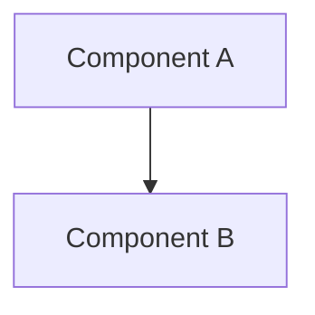

# Proposals Section

Proposals describe HOW we are going to work, based on the findings of Research, based on Knowledge, with the Idea as context. It is the changelog for our working approach.

## Topic Folders

Each proposal is a kebab-case folder containing:

| File | Required | Purpose |
|---|---|---|
| `README.md` | Yes | Basic description and index |
| `overview.md` | Yes | The implementation plan — source of truth for the current version |
| `diagrams/` | No | Mermaid `.mmd` source files, `.svg` diagrams, and `.pdf` copies for LaTeX |
| `<name>-v1.pdf` | First version | Rendered PDF draft |
| `<name>-v2.pdf` | When updated | Subsequent draft versions |
| ... | No | Additional PDF versions as the proposal evolves |

## Versioning

- The `overview.md` file is the source of truth. It reflects the current version.
- Each time the proposal changes, create a new PDF with an incremented version number.
- Keep ALL previous PDF versions in the folder.
- The `version` field in frontmatter must match the latest PDF suffix.

Example:
```
proposals/database-migration/
├── README.md
├── overview.md
├── diagrams/
│   ├── architecture.mmd
│   ├── architecture.svg
│   └── architecture.pdf
├── database-migration-v1.pdf
├── database-migration-v2.pdf
└── database-migration-v3.pdf
```

## Setup

All tools are managed via devbox. Run once:

```bash
devbox shell
```

This installs all required packages and provisions the Eisvogel template (see `scripts/install-eisvogel.sh`).

### Required Packages (devbox.json)

| Package | Purpose |
|---|---|
| `pandoc` | Markdown to PDF conversion |
| `texlive.combined.scheme-full` | LaTeX distribution (includes xelatex, all packages) |
| `mermaid-cli` | Renders `.mmd` diagrams to `.svg` and `.pdf` |
| `nodejs` | Runtime for mermaid-cli |

### Template

The PDF uses the [Eisvogel](https://github.com/Wandmalfarbe/pandoc-latex-template) pandoc template (v3.4.0), located at `templates/eisvogel.latex`. It is downloaded automatically by the devbox init hook (`scripts/install-eisvogel.sh`). The init hook runs on `devbox shell` start and is idempotent — it only downloads if the file is missing.

## Workflows

### 1. Creating a New Proposal

Create the topic folder and required files by copying the template from `templates/proposal/`:

```
cp templates/proposal/* proposals/<topic-name>/
```

Fill in the YAML frontmatter fields in `overview.md` and write the content. The `version` field starts at `1`.

### 2. Adding Mermaid Diagrams

1. Create a `.mmd` file in the proposal's `diagrams/` folder:



2. Render it to SVG:

```bash
devbox run mmd-render proposals/<topic-name>/diagrams/*.mmd
```

3. Reference it in `overview.md`:

```markdown

```

The `mmd-render` command converts each `.mmd` file to `.svg` using Mermaid CLI. The SVG is the source format — it is vector, scalable, and text remains selectable.

### 3. Rendering the PDF

Run the full proposal render:

```bash
devbox run proposal-render <topic-name>
```

For example:

```bash
devbox run proposal-render opencode-runesmith-implementation-plan
```

This command:

1. Converts all `.mmd` files in `diagrams/` to `.svg` and `.pdf`
2. Converts `overview.md` to PDF using pandoc + xelatex with the Eisvogel template
3. Outputs `<topic-name>-v{version}.pdf` into the topic folder

The `.pdf` copies of diagrams are generated alongside the `.svg` files. When pandoc renders the PDF, a Lua filter (`scripts/svg-to-pdf.lua`) automatically swaps `.svg` image references to `.pdf` so xelatex can include them as vector graphics via `\includegraphics`.

### 4. Updating an Existing Proposal

1. Edit `overview.md`
2. If diagrams changed, update or re-render `.mmd` files
3. Increment the `version` field in the YAML frontmatter
4. Run `devbox run proposal-render <topic-name>`
5. The old PDF remains in the folder — all versions are kept (e.g., `-v1.pdf`, `-v2.pdf`)

### 5. Re-rendering Only Diagrams

If you only changed diagram `.mmd` files (not the `overview.md` content):

```bash
devbox run mmd-render proposals/<topic-name>/diagrams/*.mmd
```

This regenerates the `.svg` and `.pdf` diagram files without rebuilding the full PDF document.

## Troubleshooting

### PDF fails with "LaTeX Error: File ... not found"

A required LaTeX package is missing. Ensure `texlive.combined.scheme-full` is installed via devbox:

```bash
devbox add texlive.combined.scheme-full
```

### "Eisvogel template not found"

The template was not downloaded. Run the installer manually:

```bash
bash scripts/install-eisvogel.sh
```

Or start a devbox shell (which triggers the init hook).

### "Fontconfig warning" during rendering

These warnings from the system font configuration are harmless and can be ignored. They do not affect the PDF output.

### Mermaid diagram renders incorrectly

Check the `.mmd` syntax by running:

```bash
mmdc -i diagrams/<file>.mmd -o /dev/null
```

If there are syntax errors, they will be printed to stderr.

### Overleaf / Eisvogel Variables

The Eisvogel template supports these YAML frontmatter variables for customizing the PDF appearance:

```yaml
titlepage-color: "D8DE2C"          # Background color of title page (hex, no #)
titlepage-text-color: "5F5F5F"     # Text color on title page
titlepage-rule-color: "435488"      # Color of the decorative rule
titlepage-rule-height: 4            # Height of the rule (points)
titlepage-logo: "path/to/logo.pdf"  # Logo image on title page
titlepage-background: "bg.pdf"      # Full-page background image
toc-own-page: true                  # TOC on its own page
code-block-font-size: \small        # Font size for code blocks
watermark: "DRAFT"                  # Watermark text on every page
```

## Status Lifecycle

`draft` → `proposed` → `accepted` → `completed` / `superseded`