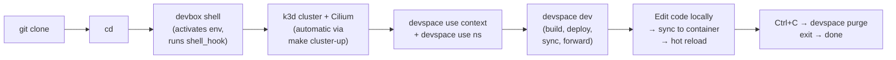

# Combined DevBox → DevSpace Workflow

This note covers the exact commands a developer runs to go from a fresh repository clone to live development on the OpenChoreo POC sample service. Each step explains what happens and why.

## Workflow Diagram



## Prerequisites

Before starting, ensure:

- [ ] **DevBox installed** — follow [DevBox installation.md](../../../tooling/devbox/installation.md)
- [ ] **Docker running** — `docker info` returns success
- [ ] **Enough resources** — 4+ GB free RAM, 2+ GB free disk for k3d images
- [ ] **Ports free** — 6443 (k3d API), 8090 (DevSpace UI), and your app port (e.g. 8080)

## Step 1: Clone the Repository

```bash
git clone <openchoreo-sample-repo-url>
cd <openchoreo-sample-repo>
```

Replace `<openchoreo-sample-repo-url>` with the URL of the OpenChoreo POC sample Go service repository. This repo contains the `devbox.json`, `devspace.yaml`, `Dockerfile`, and application source code.

## Step 2: Activate the DevBox Shell

```bash
devbox shell
```

### What Happens

1. **First run only**: DevBox downloads and installs all packages declared in `devbox.json` (kubectl, helm, k3d, cilium-cli, devspace) into the Nix store. This takes 1-3 minutes depending on network speed.
2. **Runs `init_hook`**: Sets environment variables (e.g. `KUBECONFIG`), creates required directories.
3. **Runs `shell_hook`**: Calls `make cluster-up`, which:
   - Checks if a k3d cluster named `openchoreo` already exists
   - If not: creates it with `k3d cluster create openchoreo`, then installs Cilium via `cilium install`
   - Waits for Cilium to be ready with `cilium status --wait`
   - Verifies the cluster is reachable with `kubectl cluster-info`
4. **Drops you into a subshell** with all tools on `$PATH` and the k3d cluster ready.

**Subsequent runs**: `devbox shell` reuses the existing Nix store and finds the cluster already running — completes in under a second.

### Verification Commands

After the shell prompt appears, confirm the cluster is healthy:

```bash
kubectl cluster-info
kubectl get nodes
cilium status
```

All three should return success. If `kubectl cluster-info` fails, the cluster may still be starting — wait a few seconds and retry.

## Step 3: Point DevSpace to the Cluster

```bash
devspace use context
```

Select the k3d context from the interactive list (usually named `k3d-openchoreo` or `default`).

```bash
devspace use namespace openchoreo
```

This creates the `openchoreo` namespace if it does not exist and sets it as the active namespace for DevSpace.

## Step 4: Start the Dev Inner Loop

```bash
devspace dev
```

### What Happens Step by Step

| # | Event | Description |
|---|---|---|
| 1 | `run_dependencies --all` | Deploys any dependent DevSpace projects (if configured) |
| 2 | `create_deployments --all` | Deploys the Helm chart (or kubectl manifests) defined in `devspace.yaml` |
| 3 | Image swap | Replaces the deployment's container image with a dev image (prebuilt with dev tooling) |
| 4 | File sync starts | Bi-directional sync between local project directory and container working directory |
| 5 | Port forwarding | Forwards container ports to localhost (e.g. `8080:8080`, `2345:2345` for debugging) |
| 6 | Terminal opens | Drops you into a shell inside the running container |
| 7 | DevSpace UI | Available at `http://localhost:8090` — shows sync status, forwarded ports, pod logs |

### Flags Commonly Used

| Flag | Use Case |
|---|---|
| `--skip-build` | Skip image build when only code changes are needed |
| `--force-build -b` | Force a fresh image build |
| `--force-deploy -d` | Force redeployment even if no changes detected |
| `--show-ui=false` | Disable the localhost UI (frees port 8090) |
| `-p debug` | Apply the `debug` profile (e.g. `sleep 99999` for manual investigation) |

## Step 5: Start the Application

Once the dev container terminal appears, start the application:

```bash
go run ./cmd/service
```

Or for compiled languages with hot reload configured:

```bash
air                                # Go live reload (alternative)
npm run dev                        # Node.js with nodemon
python main.py --reload            # Python with auto-reload
```

The application is now accessible at the forwarded port (e.g. `http://localhost:8080`).

## Step 6: Live Development — Edit → Sync → Reload

The inner development loop works as follows:

### Edit Locally

Modify any source file in your local project directory using your preferred editor or IDE.

### Sync to Container

DevSpace detects the file change via inotify (or polling) and transfers the changed file to the container within ~1 second.

### Reload Mechanism

| Scenario | Behavior |
|---|---|
| **Interpreted language** (Python, Node.js) | Language-native watcher detects file change, reloads automatically |
| **Compiled language, restartContainer configured** | DevSpace restarts the container process after sync completes |
| **Compiled language, air/nodemon configured** | Hot reload tool detects change, recompiles and restarts instantly |

The `devspace.yaml` dev section determines which mechanism applies. See [DevSpace file sync & hot reload](file-sync-hot-reload.md) for configuration details.

### Verify

Open `http://localhost:8080` (or your app's port) in a browser — changes are reflected immediately.

## Step 7: Stop and Clean Up

### Stop Dev Mode (Keep Deployments)

```bash
# Press Ctrl+C in the devspace dev terminal
devspace reset pods     # Revert dev image swap, keep app running
```

### Full Teardown

```bash
devspace purge          # Remove all DevSpace-created deployments
exit                    # Leave DevBox shell
k3d cluster delete openchoreo   # Destroy the local cluster (optional)
```

### Cleanup Reference

| Command | Effect |
|---|---|
| `devspace reset pods` | Reverts dev mode, restores original container image |
| `devspace purge` | Removes all deployments created by DevSpace |
| `devspace cleanup images` | Removes locally built Docker images |
| `exit` (from DevBox shell) | Leaves the isolated environment |
| `k3d cluster delete openchoreo` | Destroys the local Kubernetes cluster |

See [DevSpace cleanup & teardown](cleanup-teardown.md) for detailed cleanup options.

## Troubleshooting

### "devspace dev" Hangs at "Waiting for Pod"

Check cluster health:

```bash
kubectl get pods -n openchoreo
kubectl describe pod -n openchoreo <pod-name>
```

The image pull may be slow on first run. If the pod shows `ImagePullBackOff`, check image name and registry access.

### File Sync Not Working

Ensure `tar` is present in the container image. DevSpace injects its sync helper via `kubectl cp`, which requires `tar` on both ends. See [DevSpace file sync pitfalls](file-sync-hot-reload.md#pitfalls).

### Port Conflict on 8090

```bash
devspace dev --show-ui=false   # Disable DevSpace UI
```

Or kill whatever is using port 8090. The DevSpace UI is purely local — disabling it has no effect on cluster operations.

### Cluster Creation Fails

```bash
# Check Docker is running
docker info

# Check k3d logs
k3d cluster list
k3d cluster delete openchoreo
make cluster-up                  # Retry (from inside devbox shell)
```

Common causes: Docker not running, port 6443 in use, insufficient disk space.

### DevSpace CLI Not Found

Inside the DevBox shell, verify the package is declared:

```bash
cat devbox.json | grep devspace
```

If missing, add it:

```bash
devbox add devspace@latest
```

Then exit and re-enter the shell for the change to take effect.

## Related

- [DevBox-DevSpace Integration](integration-with-devbox.md) — architecture and tool roles
- [ADR 0008](../../../../adr/0008-pilot-openchoreo-idp/overview.md) — OpenChoreo POC scope and phases
