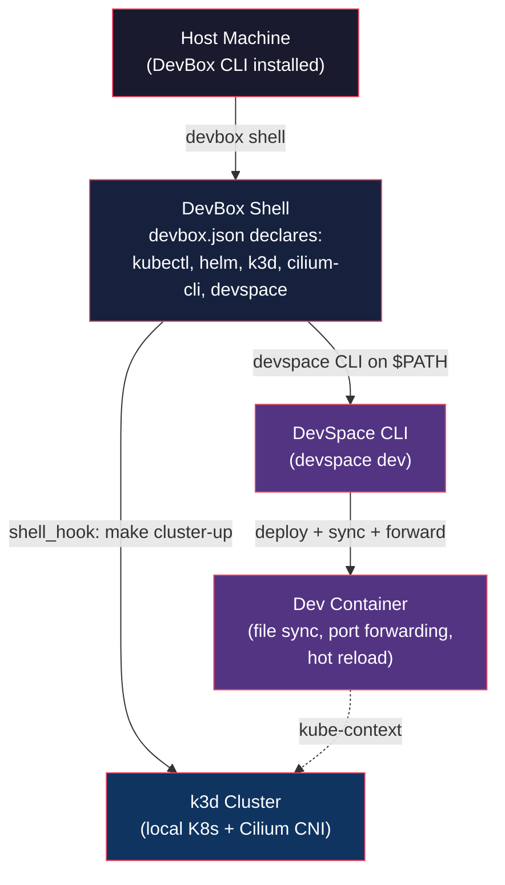

# DevBox-DevSpace Integration

## Overview

This note documents how DevBox and DevSpace compose together to form the local development environment for the OpenChoreo POC (ADR 0008). DevBox provisions the toolchain and cluster infrastructure; DevSpace delivers the Kubernetes inner development loop. Together they produce a single-command path from repo clone to live development: `devbox shell && devspace dev`.

The integration assumes a local k3d cluster with Cilium CNI, managed entirely from the DevBox shell. No host-level tool installation beyond DevBox itself is required.

## Stack Architecture



### Layer Roles

| Layer | Role | Provided By |
|---|---|---|
| **Host** | Runs DevBox CLI; only prerequisite is DevBox itself | Developer's machine |
| **DevBox Shell** | Isolated environment with all tools on `$PATH`; runs `shell_hook` on entry | `devbox.json` packages + scripts |
| **k3d Cluster** | Lightweight single-node K8s cluster with Cilium CNI for networking | `make cluster-up` called from `shell_hook` |
| **DevSpace CLI** | Builds images, deploys Helm charts, starts dev session | Declared in `devbox.json` packages |
| **Dev Container** | Running pod with file sync, port forwarding, and terminal access | `devspace dev` pipeline |

## DevBox as Toolchain Provider

The OpenChoreo POC repository declares its toolchain in `devbox.json` using the `packages` field. Each tool is pinned to a version and installed into the Nix store by DevBox, then linked into the project shell's `$PATH`.

### Declared Packages

| Package | Purpose | Source |
|---|---|---|
| `kubectl` | Interact with the Kubernetes API | DevBox Nixpkgs |
| `helm` | Deploy Helm charts (used by DevSpace) | DevBox Nixpkgs |
| `k3d` | Create and manage local K3s clusters | DevBox Nixpkgs |
| `cilium-cli` | Install and verify Cilium CNI | DevBox Nixpkgs |
| `devspace` | Inner development loop CLI | DevBox Nixpkgs |

### devbox.json Structure

The `env` field sets variables (e.g. `KUBECONFIG` path). The `shell` block defines `init_hook` and `shell_hook` (see next section) and named scripts for common tasks.

See [DevBox Knowledge Notes (PR #114)](https://github.com/RunicEngines/knowledge-base/pull/114) and [DevBox configuration.md](../../../tooling/devbox/configuration.md) for the full `devbox.json` reference.

## Shell Hook Automation

When a developer runs `devbox shell`, DevBox:

1. Installs or verifies all declared packages (first run installs; subsequent runs are near-instant)
2. Runs `init_hook` commands (fast idempotent setup)
3. Runs `shell_hook` — the main automation entry point

### What shell_hook Does

The `shell_hook` in the OpenChoreo POC `devbox.json` executes:

```bash
# Pseudocode — actual implementation in devbox.json shell_hook
make cluster-up                    # Create k3d cluster + install Cilium (if not exists)
kubectl cluster-info --request-timeout=5s  # Verify cluster is reachable
cilium status --wait               # Wait for Cilium to be ready
devspace use namespace openchoreo  # Ensure target namespace exists
```

- **First `devbox shell`**: Creates the k3d cluster (downloads images, starts container), installs Cilium via Helm, waits for readiness. This takes 30-60 seconds on a warm machine.
- **Subsequent `devbox shell`**: `make cluster-up` detects the cluster already exists and is a no-op. The hook completes in <1 second.

This automation means developers never manually run `k3d cluster create` or `cilium install` — the shell hook handles it transparently.

### Prerequisite Checks

The `shell_hook` also validates prerequisites before proceeding:

- Docker daemon is running (`docker info` exit code check)
- Required ports are free (6443 for k3d API server)
- Disk space is sufficient for k3d images

If any check fails, the hook prints a clear error message and exits, preventing the developer from reaching DevSpace with a broken cluster.

## DevSpace Inside the DevBox Shell

Once the DevBox shell is active, `devspace` is on `$PATH` and the k3d cluster's kube-context is already set. The developer runs:

```bash
devspace dev
```

This works without additional configuration because:

- The kube-context points to the local k3d cluster (set by the cluster up script)
- DevSpace reads `devspace.yaml` from the project root
- No registry authentication is needed (images stay local or use DevSpace's built-in registry)
- Port forwarding and file sync happen automatically per the `dev` section of `devspace.yaml`

See [DevSpace core workflows](core-workflows.md) for what `devspace dev` does in detail, [file sync and hot reload](file-sync-hot-reload.md) for the sync mechanism, and [cleanup and teardown](cleanup-teardown.md) for stopping and cleaning up.

## Cross-References

| Reference | Type | Description |
|---|---|---|
| [DevBox Overview](../../../tooling/devbox/overview.md) | Knowledge | What DevBox is and how it works (PR #114) |
| [DevBox Configuration](../../../tooling/devbox/configuration.md) | Knowledge | `devbox.json` fields, packages, hooks, scripts |
| [DevBox Usage](../../../tooling/devbox/usage.md) | Knowledge | End-to-end workflow, OpenChoreo pilot patterns |
| [DevSpace Core Workflows](core-workflows.md) | Knowledge | `devspace dev` and `devspace deploy` pipelines |
| [DevSpace File Sync & Hot Reload](file-sync-hot-reload.md) | Knowledge | Bi-directional sync, port forwarding, hot reload |
| [DevSpace Cleanup & Teardown](cleanup-teardown.md) | Knowledge | `devspace reset pods`, `devspace purge`, cleanup |
| [Combined Workflow](combined-workflow.md) | Knowledge | Runnable end-to-end command sequence |
| [ADR 0008](../../../../adr/0008-pilot-openchoreo-idp/overview.md) | ADR | OpenChoreo POC scope, phases, go/no-go criteria |
