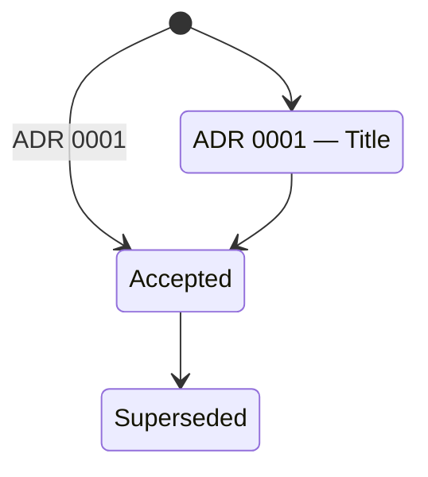

# Status Section

Status captures the live registry of what's currently deployed — active ADRs and applied configs. This is Phase 4 of the pipeline, the feedback loop that ties deployed decisions (ADRs) and configurations to the actual cluster state.

## Structure

```
status/
├── current-adr/        # Live ADR state diagrams (Mermaid)
│   ├── kubernetes.md   #   K8s-related ADR statuses and workloads
│   └── nixos.md        #   NixOS-related ADR statuses
├── current-config/     # Deployed config inventory tables
│   ├── kubernetes.md   #   K8s manifest registry
│   └── nixos.md        #   NixOS config registry
├── hardware/           # CPU, memory, storage utilization snapshots
└── versions/           # Software version inventory
```

## Update Rules

- `current-adr/` and `current-config/` are updated during the **deployment phase** — every time a pipeline or procedure in `deployment/` runs, these files should reflect the new state.
- `hardware/` and `versions/` are manually curated or CI-promoted point-in-time snapshots.

## ADR Mermaid Diagram Conventions (`current-adr/`)

Each `current-adr/*.md` file must contain a Mermaid `stateDiagram-v2` showing every ADR in its domain and its current lifecycle status.

### Required frontmatter

```yaml
---
snapshot_date: ISO-DATE
domain: kubernetes | nixos
updated_by: ""              # Person or CI run that last updated
related_adrs: []            # Paths to ADR files in configs-and-adr/adr/
---
```

### Diagram rules

- Use `stateDiagram-v2` syntax only
- Every ADR must be a named state (e.g., `state "ADR NNNN — Title" as adrNNNN`)
- Transitions must use the ADR status lifecycle: `[*]` → `Proposed` → `Accepted` → `Deprecated` | `Superseded`
- Include a Legend table below the diagram mapping each state to its meaning

### Example



## Config Table Conventions (`current-config/`)

Each `current-config/*.md` file must contain a Markdown table listing every deployed config file and its status.

### Required frontmatter

```yaml
---
snapshot_date: ISO-DATE
domain: kubernetes | nixos
---
```

### Table format

**Kubernetes table columns:**

| File | Resource Type | Namespace | Last Applied | Status |
|---|---|---|---|---|

**NixOS table columns:**

| File | Path | Last Applied | Status |
|---|---|---|---|

- `Last Applied` is populated during deployment (date-only ISO-8601 format: `YYYY-MM-DD`). No time-of-day component.
- `Status` values: `Present`, `Modified`, `Missing`

## Frontmatter Template (hardware / versions)

Point-in-time snapshots use the existing frontmatter:

```yaml
---
snapshot_date: ISO-DATE
ci_job: ""                  # CI job URL or run ID
generated: true | false     # true if CI-generated
---
```
