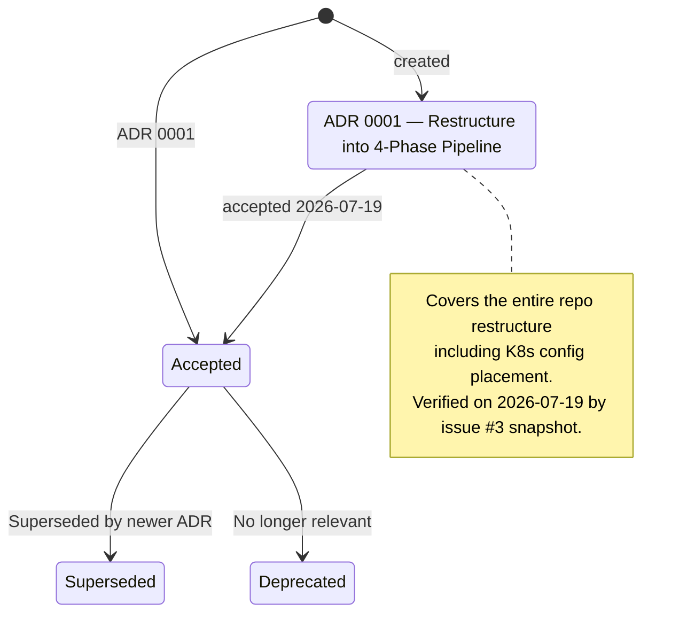

# Current Kubernetes ADRs

## Legend

| State | Meaning |
|---|---|
| `[*]` | Initial creation |
| `Accepted` | Approved and currently in effect |
| `Deprecated` | No longer relevant, not replaced |
| `Superseded` | Replaced by a newer ADR |

## Workloads

Workloads defined by these ADRs and their associated configs are tracked in `current-config/kubernetes.md`.
