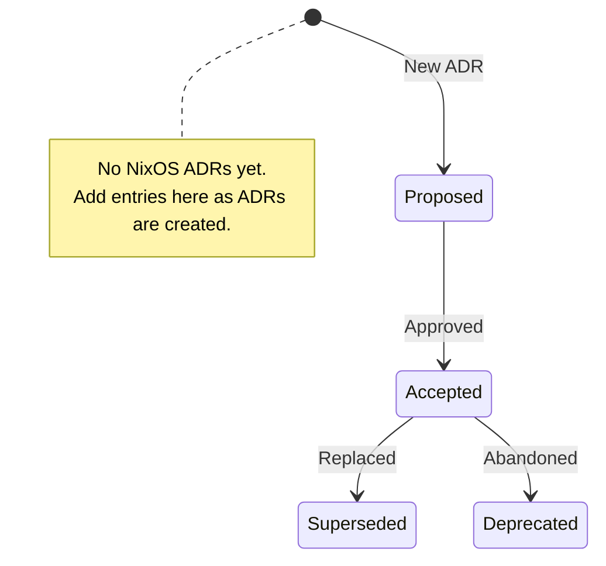

# Current NixOS ADRs

## Legend

| State | Meaning |
|---|---|
| `[*]` | Initial creation |
| `Proposed` | Under review |
| `Accepted` | Approved and currently in effect |
| `Deprecated` | No longer relevant, not replaced |
| `Superseded` | Replaced by a newer ADR |
